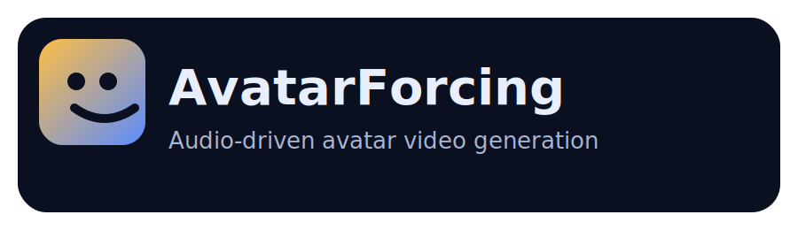

<p align="center">
  
</p>
<h1 align="center">AvatarForcing</h1>
<h3 align="center">One-Step Streaming Talking Avatars via Local-Future Sliding-Window Denoising</h3>

<p align="center">
  <a href="https://huggingface.co/lycui/AvatarForcing"></a>
  <a href="https://huggingface.co/Wan-AI/Wan2.1-T2V-1.3B"></a>
  <a href="#license"></a>
</p>

## 💡 TL;DR

AvatarForcing is a **one-step streaming diffusion** framework for talking avatars. It generates video from **one reference image + speech audio + (optional) text prompt**.

- Identity is anchored by the input image (used as the first frame).
- Audio conditioning uses a streaming speech encoder (Wav2Vec2) to produce per-frame embeddings.
- A fixed **local-future sliding window** with **heterogeneous noise levels** is jointly denoised, emitting one clean block per step under constant per-step cost.

## ✨ Highlights

- **One-step sliding-window denoising:** local-future look-ahead with heterogeneous noise, emit one clean block per step
- **Dual-anchor temporal forcing:** style anchor (RoPE re-index) + temporal anchor (reuse recent clean blocks) + anchor-audio zero-padding
- **Two-stage streaming distillation:** offline ODE backfill + distribution matching

## ⚙️ Paper Setup (Typical)

- Video: **25 FPS**, **832×480**
- Blocks/windows: **B=4 frames/block**, **L=4 window length**, **N=1 pass**
- Speed: paper reports **34 ms/frame** with a **1.3B** student model (hardware-dependent)

## 🛠️ Installation

### Recommended: create the conda env from `environment.yml`

```bash
conda env create -f environment.yml
conda activate avatarforcing
```

### FFmpeg (required by default)

FFmpeg is used to mux the input audio into the output mp4:

- Ubuntu/Debian: `sudo apt-get update && sudo apt-get install -y ffmpeg`

## 🚀 Quick Start

### 🧱 Model Download

| Models | Download Link | Notes |
|---|---|---|
| Wan2.1-T2V-1.3B | 🤗 [Huggingface](https://huggingface.co/Wan-AI/Wan2.1-T2V-1.3B) | Base model (student) |
| AvatarForcing | 🤗 [Huggingface](https://huggingface.co/lycui/AvatarForcing) | ODE init + DMD weights |
| Wav2Vec | 🤗 [Huggingface](https://huggingface.co/facebook/wav2vec2-base-960h) | Audio encoder |

Download models using `huggingface-cli`:

```sh
pip install "huggingface_hub[cli]"
mkdir -p wan_models checkpoints

huggingface-cli download Wan-AI/Wan2.1-T2V-1.3B \
  --local-dir-use-symlinks False \
  --local-dir ./wan_models/Wan-T2V-1.3

huggingface-cli download facebook/wav2vec2-base-960h \
  --local-dir-use-symlinks False \
  --local-dir ./wan_models/wav2vec2-base-960h

huggingface-cli download lycui/AvatarForcing \
  --local-dir-use-symlinks False \
  --local-dir ./checkpoints
```

### CLI inference
Run inference:

```bash
python3 inference.py \
  --config_path configs/avatarforcing.yaml \
  --output_folder outputs \
  --checkpoint_path checkpoints/model.pt \
  --data_path <your_data_path> \
  --num_output_frames 225 \
  --i2v
```

Notes:

- The script currently supports I2V only (requires `--i2v`).
- Choose `--num_output_frames` so that `(--num_output_frames - 1)` is divisible by `B=4` (e.g., `225 = 4 * 56 + 1`).
- If you downloaded weights to `checkpoints/`, set `--checkpoint_path` to the actual `.pt` file you want to load (e.g., `checkpoints/model.pt`).

## 📝 Citation

```bibtex
@misc{cui2026avatarforcingonestepstreamingtalking,
      title={AvatarForcing: One-Step Streaming Talking Avatars via Local-Future Sliding-Window Denoising}, 
      author={Liyuan Cui and Wentao Hu and Wenyuan Zhang and Zesong Yang and Fan Shi and Xiaoqiang Liu},
      year={2026},
      eprint={2603.14331},
      archivePrefix={arXiv},
      primaryClass={cs.CV},
      url={https://arxiv.org/abs/2603.14331}, 
}
```

## 🙏 Acknowledgements

- We thank the authors of [Wan2.1](https://github.com/Wan-Video/Wan2.1), [OmniAvatar](https://github.com/Omni-Avatar/OmniAvatar), [Wan-S2V](https://github.com/Wan-Video/Wan2.2), and [Self-Forcing](https://github.com/guandeh17/Self-Forcing) for releasing their models and code, which provided valuable references and support for this work. We appreciate their contributions to the open-source community.

## 📜 License

Apache-2.0
